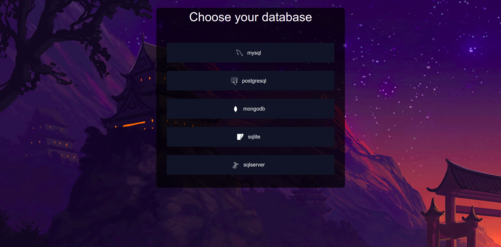
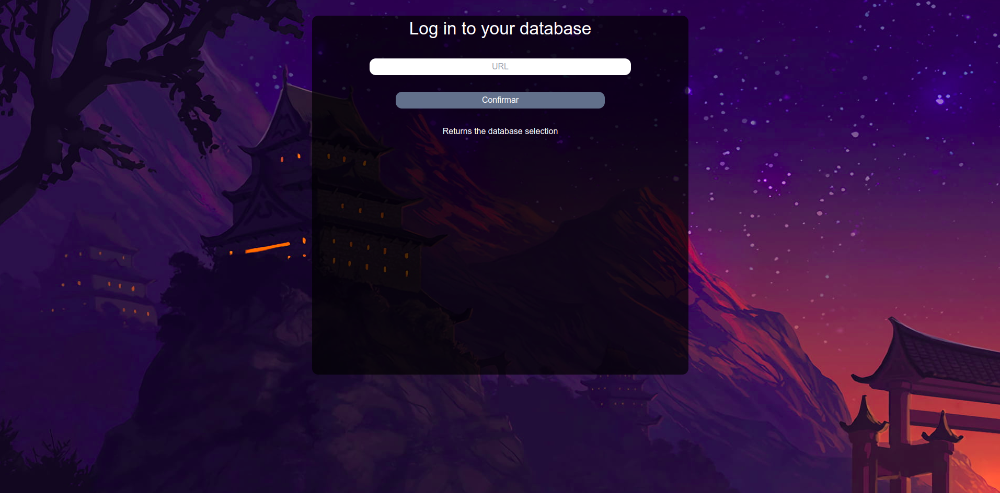
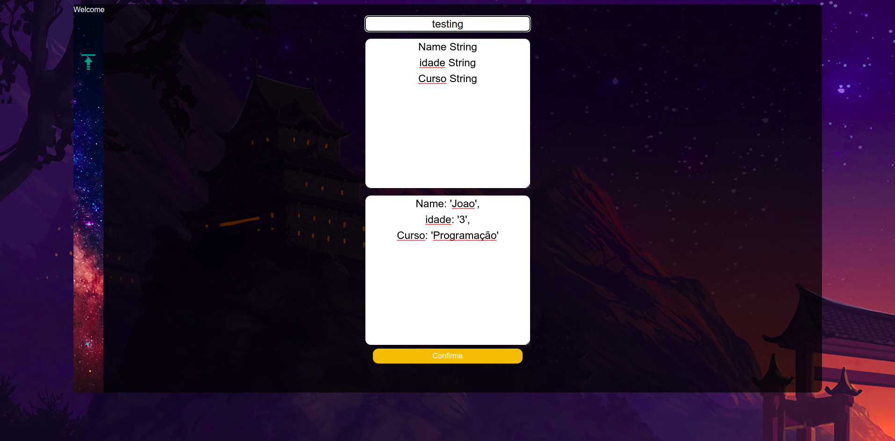
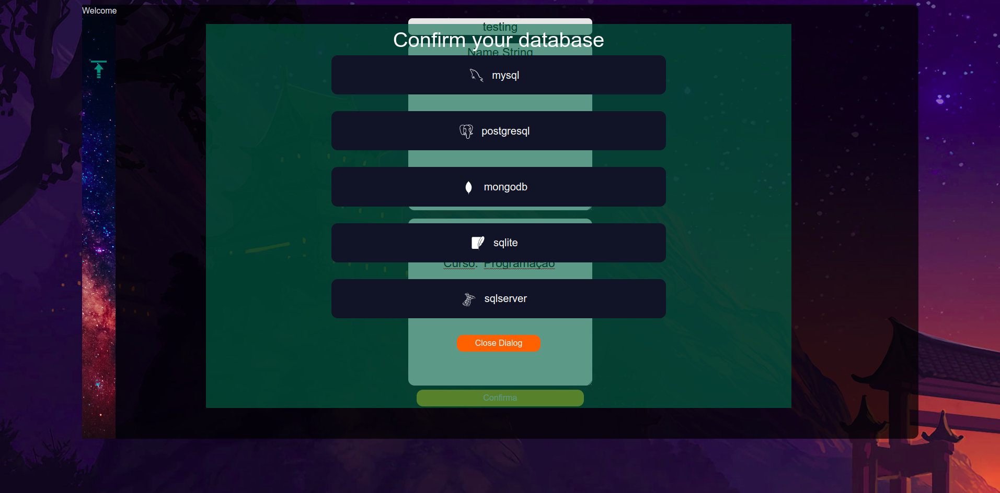
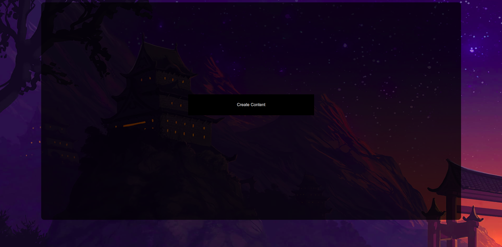
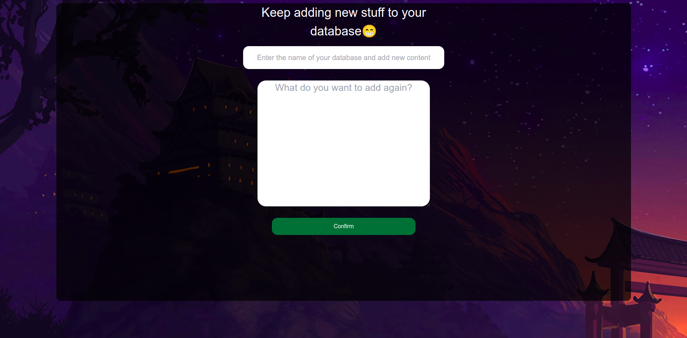

This is a [Next.js](https://nextjs.org/) project bootstrapped with [`create-next-app`](https://github.com/vercel/next.js/tree/canary/packages/create-next-app).

## Getting Started

First, run the development server:

```bash
npm run dev
# or
yarn dev
# or
pnpm dev
```

Open [http://localhost:3000](http://localhost:3000) with your browser to see the result.

# Avisos


<h2
style='text-align: center;'>
SEMPRE USAR UMA DATABASE VAZIA , 
PARA NÃO OCORRER CONFLITOS , E SUAS TABELAS
SEREM <strong> APAGADAS </strong>
</h2>

<br> <br>

<h2
style='text-align: center;'>
O TEMPO DE CRIAÇÃO DA 
TABELA VAI DEPENDER DE QUAL BANCO DE DADOS , 
VOCÊ ESTIVER USANDO
</h2>

<br>

# About
<br>
<h2
style='text-align: center;'>
Isso e a Nossa Home
</h2>

<p
style='
display: block;
position: relative;
text-align: center;
position: relative;
margin-bottom: 1rem;'>
    A Home tem como objetivo , você ter a oportunidade de escolher
    qual banco de dados você irár usar , para o melhor aproveito
    da aplicação
</p>




<h2
style='text-align: center;'>
SUA URL
</h2>

<p
style='
display: block; 
position: relative;
margin-bottom: 1rem;'>
    Aqui tem como objetivo você fazer a conexão com
    o seu banco de dados , passando a URL corretamente,
    para não ouver nenhum tipo de problema na aplicação
</p>




<h2
style='text-align: center;'>
Criando a Tabela
</h2>

<p
style='
display: block; 
position: relative;
margin-bottom: 1rem;'>
    Aqui você irar escolher o nome da sua tabela,
    e depois os conteudos que irár ter nela , seguindo
    esse procedimento não haverar erro
</p>





<h2
style='text-align: center;'>
Confirmação Banco de Dados
</h2>

<p
style='
display: block; 
position: relative;
margin-bottom: 1rem;'>
    Aqui pedimos a confirmação do usuario , para continuar o procedimento de criação da tabela
</p>




<h2
style='text-align: center;'>
Criação da Tabela
</h2>

<p
style='
display: block; 
position: relative;
margin-bottom: 1rem;'>
    Passando por aqui ao apertar o 
    botão ,  ele irár te enviar para a
    criação do conteudo sobre sua tabela
    criação dos conteudos
    da tabela
</p>




<h2
style='text-align: center;'>
Finalizando
</h2>

<p
style='
display: block; 
position: relative;
margin-bottom: 1rem;'>
    Aqui você e livre para adicionar o 
    conteudo da sua tabela,
</p>




<li>Primeiro Coloque o nome da Tabela Criada</li>
<br>

<li>
Depois coloque o conteudo que vai 
conter ela, 
</li>
<br>

<h2>
Exemplo: 
<br>

<h3>User</h3>
<h3>Nome: "Joao"</h3>

</h2>


